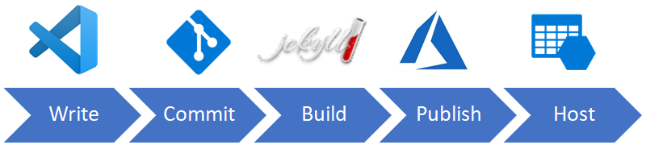

# JekyllBlog

This is sample solution for my blog post series about how to build and publish Jekyll static blog to Azure static website using Azure DevOps build and release pipelines: [Static blog with Jekyll, Azure and Azure DevOps](https://gunnarpeipman.com/azure/jekyll-azure-static-website/)

## Live demo

Live demo is available here: https://jekyll.gunnarpeipman.com/

## Publishing process

Main idea of this experiment is to keep blogging lightweight. On laptop, desktop or tablet we need just git client and our favorite markup editor to write blog posts. We can blog wherever we want and thanks to branches in Git we can also have draft writings.

1. **Write** blog post using your machine and tools you like
2. **Commit** blog changes to Git when done
3. **Build** static blog on Azure DevOps using Jekyll
4. **Publish** new state of blog using Azure DevOps release pipeline
5. **Host** your site on Azure static website
